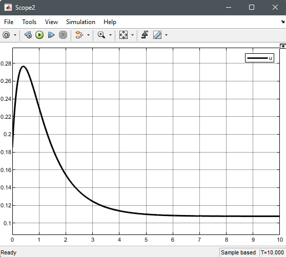

# NonLinear_Control_Theory
Repo to store non-linear control algorithms and model

## HW3

Phase plane of stable system

Phase plane of unstable system

Phase plane of marginally stable system

## HW4

System with Coulomb friction

## HW6

Height vs time:

Inflow vs time

